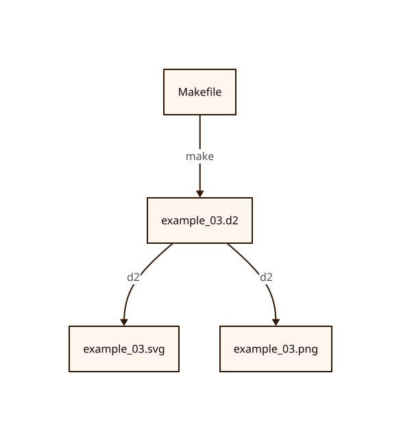

# Example 03

This Graph uses the Makefile to generate the d2 source file and both a SVG and PNG that shows the workflow of the Makefile.

## Instructions

`make build`

Will turn this:
```
'Makefile' -> 'example_03.d2': make
'example_03.d2' -> 'example_03.svg': d2
'example_03.d2' -> 'example_03.png': d2
```

Into: 


