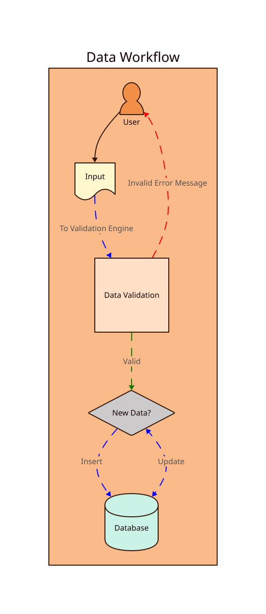

# Example 4

This d2 graph utilizes the animated edge and "canned themes" features of d2 to provide a simple data flow diagram.

We set the [numbered theme](https://d2lang.com/tour/themes/) on the command line of our makefile.


## Instructions

1. `brew install d2`
2. `make build`

Will turn this:

```
workflow: Data Workflow {
    user: User {
        shape: person
    }

    input: Input {
        shape: document
    }

    validation: Data Validation {
        shape: square
    }

    new: New Data? {
        shape: diamond
    }

    store: Database {
        shape: Cylinder
    }

    user -> input
    input -> validation: To Validation Engine {
        style: {
            stroke-dash: 8
            stroke: blue
            animated: true
        }
    }
    validation -> new: Valid {
        style: {
            stroke-dash: 8
            stroke: green
            animated: true
        }
    }

    validation -> user: Invalid Error Message {
        style: {
            stroke-dash: 8
            stroke: red
            animated: true
        }
    }
    new -> store: Insert {
        style: {
            stroke-dash: 8
            stroke: blue
            animated: true
        }
    }

    new <-> store: Update {
        style: {
            stroke-dash: 8
            stroke: blue
            animated: true
        }
    }

}


```

Into this:



