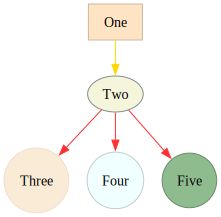

# Example 1

Let's graph a simple hierarchical relationship

## Instructions

1. `brew install graphviz`
2. `make build`


Will turn this:

```
digraph "example_01" {


	one [
		label     = "One";
		shape     = "rectangle";
		color     = "bisque3";
		fillcolor = "bisque";
		style     = "filled";
	]

	two [
		label = "Two"
		shape = "oval";
		color = "azure4";
		fillcolor = "beige";
		style     = "filled";
	]

	three [
		label = "Three"
		shape = "circle";
		color = "antiquewhite2";
		fillcolor = "antiquewhite";
		style     = "filled";
	]

	four [
		label = "Four"
		shape = "circle";
		color = "azure3";
		fillcolor = "azure";
		style     = "filled";
	]

	five [
		label = "Five"
		shape = "circle";
		color = "darkseagreen4";
		fillcolor = "darkseagreen";
		style     = "filled";
	]

	one -> two[color="gold"];
	two -> three[color="firebrick1"];
	two -> four[color="firebrick1"];
	two -> five[color="firebrick1"];
}
```
Into:


