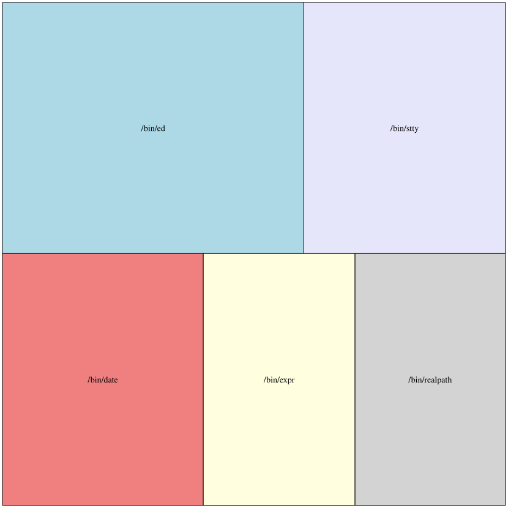

# Example 1

This example will use the ["patchwork layout"](https://graphviz.org/docs/layouts/patchwork/) to generate a graph that compares file sizes of 5 utilities in the bin directory.

This example also uses the Makefile to generate the `.dot` graph source file, and create the images.

## Instructions

1. `brew install graphviz`
2. `make build`


Will turn this:

```
digraph {
	graph [layout=patchwork];
	node [style=filled];
	1	[area=202,
		fillcolor=lightblue,
		label="/bin/ed"];
	2	[area=135,
		fillcolor=lavender,
		label="/bin/stty"];
	3	[area=135,
		fillcolor=lightcoral,
		label="/bin/date"];
	4	[area=102,
		fillcolor=lightyellow,
		label="/bin/expr"];
	5	[area=101,
		label="/bin/realpath"];
}

```
Into:



