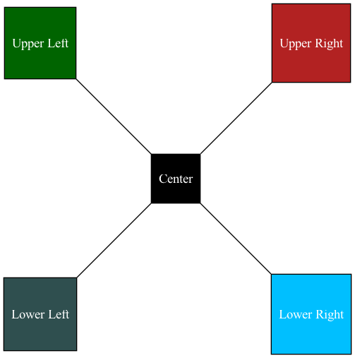

# Example 4

In this example, we use the [neato](https://graphviz.org/docs/layouts/neato/) layout engine alongside the `pin` and `pos` (position) attributes to "pin" nodes to a specific set of XY coordinates.

## Instructions

1. `brew install graphviz`
2. `make build`

Will turn this:

```
graph "example_04" {
    layout=neato;

    node [
        pin=true;
        shape=square;
        style=filled;
     ]

     nodesep="4";

    upperleft [
        pos="0,4";
        label="Upper Left";
        fillcolor="darkgreen";
        fontcolor="white";

    ]

    upperright [
        pos="4,4";
        label="Upper Right";
        fillcolor="firebrick";
        fontcolor="white";

    ]

    lowerleft [
        pos="0,0";
        label="Lower Left";
        fillcolor="darkslategrey";
        fontcolor="white";
    ]

    lowerright [
        pos="4,0";
        label="Lower Right";
        fillcolor="deepskyblue";
        fontcolor="white";
    ]

    center [
        pos="2,2";
        label="Center";
        fillcolor="black";
        fontcolor="white";
    ]

    upperleft -- center;
    upperright -- center;
    lowerleft -- center;
    lowerright -- center;

}
```

Into:



