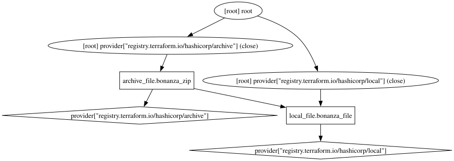

# Example 5

This graphviz graph is somewhat special, the `.dot` file is generated by Hashicorp Terraform, specifically the `terraform graph` subcommand that produces a graphviz file in the `dot` format.

## Instructions

## Mac
1. `brew install graphviz`
2. `make build`
3. `brew tap hashicorp/tap`
4. `brew install hashicorp/tap/terraform`

## Windows
1. `choco install graphviz`
2. `choco install make`
3. `choco install terraform`
4. `make build`

## Linux
The world is your oyster, do what you like.
1. `make build`

These instructions will turn this simple Terraform HCL file:

```
resource "local_file" "bonanza_file" {
    content   = "Bonanza!"
    filename = "${path.module}/bonanza.txt"
}

resource "archive_file" "bonanza_zip" {
    type        = "zip"
    source_file = "${path.module}/bonanza.txt"
    output_path = "${path.module}/bonanza.zip"

   depends_on   = [local_file.bonanza_file]
}

```
Into this `dot` file:

```
digraph {
	compound = "true"
	newrank = "true"
	subgraph "root" {
		"[root] archive_file.bonanza_zip (expand)" [label = "archive_file.bonanza_zip", shape = "box"]
		"[root] local_file.bonanza_file (expand)" [label = "local_file.bonanza_file", shape = "box"]
		"[root] provider[\"registry.terraform.io/hashicorp/archive\"]" [label = "provider[\"registry.terraform.io/hashicorp/archive\"]", shape = "diamond"]
		"[root] provider[\"registry.terraform.io/hashicorp/local\"]" [label = "provider[\"registry.terraform.io/hashicorp/local\"]", shape = "diamond"]
		"[root] archive_file.bonanza_zip (expand)" -> "[root] local_file.bonanza_file (expand)"
		"[root] archive_file.bonanza_zip (expand)" -> "[root] provider[\"registry.terraform.io/hashicorp/archive\"]"
		"[root] local_file.bonanza_file (expand)" -> "[root] provider[\"registry.terraform.io/hashicorp/local\"]"
		"[root] provider[\"registry.terraform.io/hashicorp/archive\"] (close)" -> "[root] archive_file.bonanza_zip (expand)"
		"[root] provider[\"registry.terraform.io/hashicorp/local\"] (close)" -> "[root] local_file.bonanza_file (expand)"
		"[root] root" -> "[root] provider[\"registry.terraform.io/hashicorp/archive\"] (close)"
		"[root] root" -> "[root] provider[\"registry.terraform.io/hashicorp/local\"] (close)"
	}
}

```

And finally Into this SVG:



