# Example 1

This graph uses the [mermaid.js](https://mermaid.js.org/)

## Instructions

Install node 24 I prefer to use [mise](https://mise.jdx.dev/)

So the instructions for using mise are as follows for a MAC
1. `brew install mise`
2. Make sure mise is in your path env var, if not restart your shell
3. `mise use node@24`
4. `make build`

Will turn this:

```
graph TD
    A[One] --> B[Two]
    B --> C[Three]
    B --> D[Four]
    B --> E[Five]

    style A fill:#EDE4B9,stroke:#EBEBC5,stroke-width:2px
    style B fill:#C5DBEB,stroke:#BDCDD9,stroke-width:2px
    style C fill:#BCCFA1,stroke:#C5DBEB,stroke-width:2px
    style D fill:#BCCFA1,stroke:#C5DBEB,stroke-width:2px
    style E fill:#BCCFA1,stroke:#EBEBC5,stroke-width:2px
```

Into:

