# Example 2

This mermaid diagram uses a newer feature of mermaid.js to generate a simple  contrived Pub/Sub diagram.

## Instructions

Install node 24 I prefer to use [mise](https://mise.jdx.dev/)

## MAC
1. `brew install mise`
2. Make sure mise is in your path env var, if not restart your shell
3. `mise use node@24`
4. `make build`

## Windows
1. `choco install mise`
2. `choco install gnuwin32-m4`
2. `mise use make@latest4`
3. `mise use node@24`
4. `make build`


## Linux

Install mise, have fun.

Will turn this:

```
architecture-beta
    group pubsub(cloud)[PubSub]
    service src1(server)[Source Data] in pubsub
    service queue(server)[Publisher] in pubsub
    service sub1(server)[Subscriber 1] in pubsub
    service sub2(server)[Subscriber 2] in pubsub
    service sub3(server)[Subscriber 3] in pubsub
    src1:B --> T:queue
    queue:B --> T:sub1
    queue:B --> T:sub2
    queue:B --> T:sub3
    align row sub1 sub2 sub3


```

Into this:



