# Example 1

This graph uses [merman](https://github.com/Latias94/merman) a Rust command line tool and library for rendering mermaid diagrams.

## Instructions

1. `brew install merman`
2. `make build`

Will turn this:

```
graph TD
    A[One] --> B[Two]
    B --> C[Three]
    B --> D[Four]
    B --> E[Five]

    style A fill:#EDE4B9,stroke:#EBEBC5,stroke-width:2px
    style B fill:#C5DBEB,stroke:#BDCDD9,stroke-width:2px
    style C fill:#BCCFA1,stroke:#C5DBEB,stroke-width:2px
    style D fill:#BCCFA1,stroke:#C5DBEB,stroke-width:2px
    style E fill:#BCCFA1,stroke:#EBEBC5,stroke-width:2px
```

Into:

