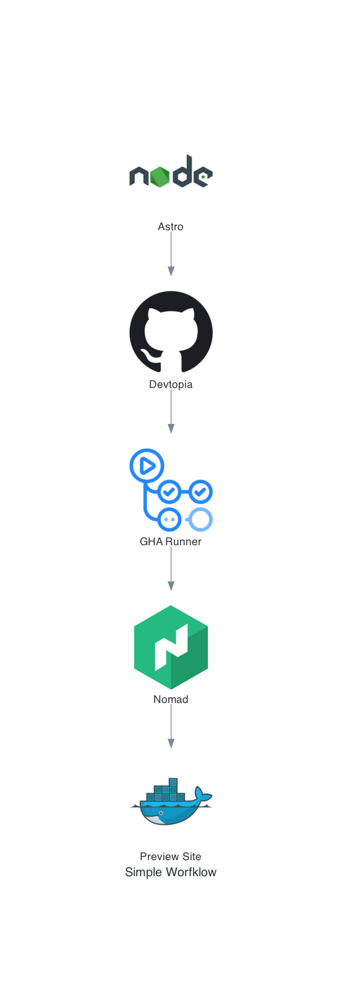

# Example 1

This Graph differs from the other 

## Instructions

Install Python3 I prefer to use [mise](https://mise.jdx.dev/)

So the instructions for using mise are as follows for a MAC
1. `brew install mise`
2. Make sure mise is in your path env var, if not restart your shell
3. `mise use python@latest`
4. `pip install diagram`
5. `make build`

Will turn this:

```
from diagrams import Diagram
from diagrams.onprem.ci import GithubActions
from diagrams.onprem.compute import Nomad
from diagrams.onprem.container import Docker
from diagrams.onprem.vcs import Github
from diagrams.programming.language import Nodejs

# Constant to specify the output file prefix
OUPUT_FILE = "example_01"

# Very Simple diagram using the bitshift operator for edges
with Diagram("Simple Worfklow", show=False, filename=OUPUT_FILE, direction="TB", outformat=["svg", "png"]):
    Nodejs("Astro") >> Github("Enterprise") >> GithubActions("GHA Runner") >> Nomad("Nomad") >> Docker("Preview Site")
```

Into:

